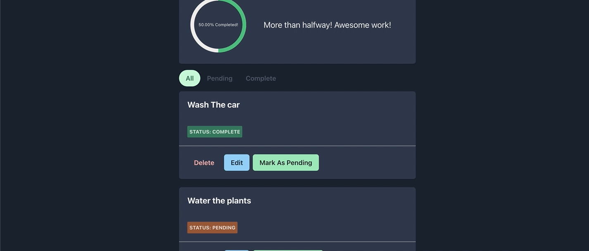

# Todo Application Front End

This is front end for a custom Todo Application.

## Features

- Login and Sign up Users
- Form Validation during Signup and Login
- Subtle animations to switch between signup and Login Form
- Manage Dark and Light mode as per user preference
- Add a task
- Edit a task
- Mark a task as complete
- Delete a task
- Filter tasks by their status
- See overall progress and a little motivational message to keep going
- Toasts to give the user proper feedback incase of success and errors.

## Tools and Technologies

The Front End application has been developed using

- `Vite + React (JS)`
- `Chakra UI`

## Run Locally

To run locally, first make sure that you have the required dependencies installed

- Node >= v18.16.0
- npm >= 9.5.1

Clone the project

```bash
  git clone https://github.com/MoonRock000/todo-frontend
```

Go to the project directory

```bash
  cd todo-frontend
```

Install dependencies

```bash
  npm install
```

Start the server

```bash
  npm run dev
```

## Running Tests

To run tests, run the following command

Running Tests

```bash
npm run test
```

## Screens Demo Gifs

### Auth Page


### Sign up


### Add a task


### Completing a task


### Filters



### Edit a task


### Delete a task


## Authors

- [@Morris Emin](https://github.com/MoonRock000/)
